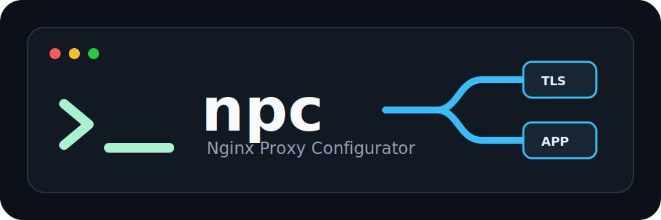
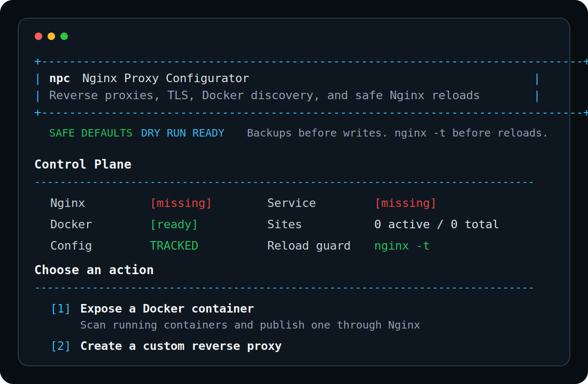
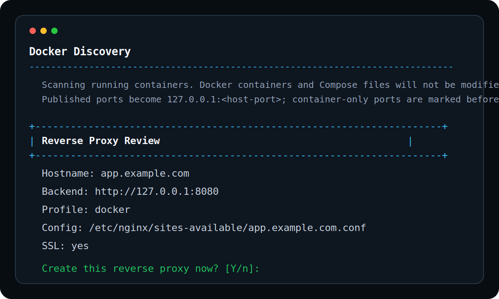

<p align="center">
  
</p>

# npc

`npc` is the **Nginx Proxy Configurator**: a single Go binary for installing, configuring, testing, and managing Nginx reverse proxy sites on Linux.

It is built for administrators who want repeatable reverse proxy setup with safer defaults: backups before writes, `nginx -t` before reloads, explicit metadata, dry runs, and clear failure messages. This project started from a generated broad spec, so early releases should still be reviewed carefully before production rollout.

## Screenshots





## Status

`v0.1.x` is the first MVP line. It includes the CLI structure, terminal UI, Docker discovery, HTTP reverse proxy generation, manual certificate config, acme.sh HTTP-01 support, backups, config revisions, import/inspect/repair helpers, release builds, and tests. Some advanced flows are intentionally conservative and will mature over later releases.

## Install

```bash
curl -L -o npc https://github.com/brightcolor/npc/releases/latest/download/npc-linux-amd64
chmod +x npc
sudo ./npc --install
npc --version
```

For ARM64:

```bash
curl -L -o npc https://github.com/brightcolor/npc/releases/latest/download/npc-linux-arm64
chmod +x npc
sudo ./npc --install
```

`sudo ./npc --install` copies the running binary to `/usr/local/bin/npc`, backs up an existing binary as `/usr/local/bin/npc.bak.<timestamp>`, and sets executable permissions.

## Quick Start

Start the terminal UI:

```bash
npc
```

The UI can scan running Docker containers, list their available ports, and create a reverse proxy for the selected container. Published Docker ports are exposed through `127.0.0.1:<host-port>`. Container-only ports are offered with a warning because host Nginx must be able to reach the container name through networking.

The UI shows a dashboard with Nginx, Docker, and managed-site status before each action. It uses status badges, action cards, and a review screen before writing anything. If no sites exist yet, `npc list` and the UI show an empty-state message instead of returning a blank table.

Managed sites can also be edited and deleted from the UI. Editing lets you change the backend host, port, scheme, profile, body size, WebSocket headers, security header profile, and per-site logs before reviewing the rendered Nginx config. Deleting always disables the site first, offers a backup, and then lets you choose whether to remove the Nginx config, npc metadata, and certificate files.

The UI includes a Cloudflare DNS-01 setup flow. It stores the Cloudflare API token, account ID, and optional zone ID under `/etc/npc/secrets/cloudflare.env` with mode `0600`. Secrets are not compiled into npc and are not printed back in the UI.

When a valid Cloudflare secret file already exists, npc treats Cloudflare DNS-01 as the preferred ACME default. The UI offers to use the saved Cloudflare credentials, `npc create` defaults to `--acme-method dns --dns-provider cloudflare`, and the ACME account email prompt becomes optional.

Let's Encrypt is the default ACME CA. `npc` also sets acme.sh's default CA to Let's Encrypt after installing acme.sh and before ACME issuance. Use `--acme-ca buypass` only when a site should use Buypass instead.

On startup, the UI checks GitHub Releases for a newer npc version. If an update is available, it shows the current version, the latest version, and the release changelog before opening the main menu. The menu then includes an **Upgrade npc** entry.

At startup, the UI checks for Nginx and `acme.sh`. If either tool is missing, `npc` asks whether it should install it. Nginx is installed through `apt`; `acme.sh` is installed through the official installer. Installation requires root, so start the UI with `sudo npc` when you want npc to install missing dependencies.

`acme.sh` usually installs into `/root/.acme.sh/acme.sh` when `npc` runs as root. `npc` runs the official installer using `email=<address>` when an account email is provided, searches the install location directly, and does not require `acme.sh` to be available in `$PATH`.

Create a local reverse proxy interactively:

```bash
sudo npc create
```

Before writing a site, `npc create` checks whether Nginx is installed. If Nginx is missing, it asks before installing it through `apt`. When `--acme` is enabled, `npc` also checks for `acme.sh` and asks before installing it.

For unattended provisioning, combine `--non-interactive` with `--force`:

```bash
sudo npc create \
  --hostname app.example.com \
  --backend-host 127.0.0.1 \
  --backend-port 3000 \
  --backend-scheme http \
  --non-interactive \
  --force
```

Create one non-interactively:

```bash
sudo npc create \
  --hostname app.example.com \
  --backend-host 127.0.0.1 \
  --backend-port 3000 \
  --backend-scheme http \
  --non-interactive
```

Fast path with production defaults:

```bash
sudo npc app.example.com 3000
```

This shortcut means:

- public hostname: `app.example.com`
- backend: `http://127.0.0.1:3000`
- HTTPS enabled with acme.sh HTTP-01
- HTTP to HTTPS redirect enabled
- WebSocket headers enabled
- HTTP/2 enabled
- standard security headers enabled
- per-site access and error logs enabled
- no overwrite when the vHost already exists

The shortcut does not open the assistant. It stops only when validation fails, Nginx/acme.sh installation fails, certificate issuance fails, `nginx -t` fails, or the vHost already exists.

Preview without writing:

```bash
npc create \
  --hostname app.example.com \
  --backend-host 127.0.0.1 \
  --backend-port 3000 \
  --backend-scheme http \
  --non-interactive \
  --dry-run
```

## Managed Nginx Config Discovery

npc stores site metadata in `/etc/npc/config.yaml`, but it also scans `/etc/nginx/sites-available/*.conf` on commands that load managed sites. Any config with this header is treated as npc-managed even when the YAML entry is missing:

```nginx
# Managed by npc
# Do not edit manually unless you know what you are doing.
# Hostname: app.example.com
```

Discovered header configs are available in `npc list`, `npc show`, `npc edit`, `npc delete`, `npc certs`, `npc check`, `npc maintenance`, backup, health output, and the terminal UI. Discovery is read-only for list and inspection commands. npc only writes metadata after an explicit write action such as `edit`, `set`, `archive`, `repair`, or `rollback`.

`npc create` will not silently overwrite an existing npc-managed config discovered from `sites-available`. Use `npc edit <hostname>` for normal changes or `--force` only when replacing the generated config is intentional.

## Managing Many Sites

Large vHost inventories should be grouped and filtered instead of managed from one long table. npc stores optional metadata per site:

- `alias`: short unique name for commands, for example `shop-api`.
- `group`: one owner or environment bucket, for example `customer-a` or `prod`.
- `tags`: comma-separated labels, for example `docker,api,production`.
- `archived`: hides old sites from normal lists without deleting configs or metadata.

Set metadata when creating a site:

```bash
sudo npc create \
  --hostname api.example.com \
  --backend-host 127.0.0.1 \
  --backend-port 3000 \
  --alias shop-api \
  --group customer-a \
  --tags docker,api,production \
  --non-interactive
```

Set or replace metadata later:

```bash
sudo npc set api.example.com --alias shop-api
sudo npc set shop-api --group customer-a
sudo npc set shop-api --tags docker,api,production
```

After an alias is set, commands that load one site accept either the hostname or alias:

```bash
npc show shop-api
sudo npc edit shop-api
sudo npc disable shop-api
```

### List Filters

`npc list` hides archived sites by default and prints a compact table:

```bash
npc list
npc list --wide
```

Supported filters:

```bash
npc list --enabled              # only enabled sites
npc list --disabled             # only disabled sites
npc list --ssl                  # only HTTPS sites
npc list --no-ssl               # only HTTP-only sites
npc list --profile docker       # exact profile match
npc list --domain example.com   # hostname suffix match
npc list --backend 127.0.0.1    # backend URL contains this text
npc list --group customer-a     # exact group match
npc list --tag production       # site has this tag
npc list --archived             # only archived sites
npc list --all                  # include archived sites
```

Filters can be combined. A site must match all selected filters.

Sorting:

```bash
npc list --sort hostname
npc list --sort backend
npc list --sort profile
npc list --sort updated
npc list --sort enabled
npc list --sort cert-expiry
```

### Search

`npc search <query>` searches hostname, alias, group, tags, profile, backend URL, ACME method, and DNS provider. Search includes archived sites.

```bash
npc search api
npc search customer-a
npc search 3000
```

### Status by Scope

`npc status` supports the same filters as `npc list`, so you can get scoped counters:

```bash
npc status --group customer-a
npc status --tag production
npc status --profile docker --json
```

### Health and Problem Views

`npc health` is an alias for `npc monitor`. It prints runtime counters. `--only-problems` prints only sites with issues:

```bash
npc health
npc health --only-problems
npc health --json
```

Problem labels currently include disabled active sites, missing configs, missing or invalid certificates, and certificates with 30 days or less remaining.

For per-site checks:

```bash
npc check shop-api
npc check --all
npc check --all --json
```

### Bulk Actions

Bulk actions are intentionally conservative. Destructive or broad changes require a scope and confirmation flag.

Back up all matching sites:

```bash
sudo npc backup --group customer-a
sudo npc backup --tag production
sudo npc backup --profile docker
```

Disable a group or tag:

```bash
sudo npc disable --group staging --yes
sudo npc disable --tag temporary --yes
```

`npc disable` without a hostname refuses bulk mode unless `--group` or `--tag` and `--yes` are provided.

Renew expiring managed ACME certificates:

```bash
sudo npc certs renew --expiring
sudo npc certs renew --expiring --days 14
```

Archive old sites instead of deleting them:

```bash
sudo npc archive old-api
npc list --archived
npc list --all
sudo npc unarchive old-api
```

## How It Works

`npc` keeps the moving parts deliberately simple:

1. You describe a public hostname and a backend.
2. `npc` validates the input and checks local dependencies.
3. It checks whether the Nginx service is active and starts it when needed.
4. It renders an Nginx server config from an embedded template.
5. It writes the config to `/etc/nginx/sites-available/<hostname>.conf`.
6. It enables the site with a symlink in `/etc/nginx/sites-enabled/`.
7. It runs `nginx -t`.
8. It reloads Nginx only when the config test succeeds.
9. It stores site metadata in `/etc/npc/config.yaml`.

The generated Nginx config is a normal reverse proxy. Public traffic reaches Nginx on port 80 or 443, Nginx forwards the request to the backend service, and the backend receives standard proxy headers such as `X-Forwarded-For`, `X-Forwarded-Proto`, and `X-Real-IP`.

For acme.sh HTTP-01 sites, `npc` uses a staged flow. It first writes a temporary HTTP challenge-capable config, reloads Nginx after `nginx -t`, requests the certificate, installs the certificate under `/etc/npc/certs/<hostname>/`, then writes the final HTTPS config and reloads again after another config test.

Before HTTP-01 issuance, `npc` checks whether the hostname's A/AAAA records point to this server's public IP. If DNS does not match, certificate issuance is stopped because the ACME HTTP-01 challenge would fail from the public internet.

`npc` does not replace Nginx. It writes managed Nginx config files and leaves Nginx in charge of serving traffic.

## Docker Flow

When you run `npc` or `npc tui`, the terminal UI can scan Docker with:

```bash
docker ps --format '{{json .}}'
```

It reads container names, images, networks, and port mappings. If a container publishes a port like `0.0.0.0:8080->80/tcp`, `npc` proposes `127.0.0.1:8080` as the backend because that is reachable from host Nginx.

If a container only exposes an internal port like `80/tcp`, `npc` can still offer it, but it shows a warning. In that case Nginx on the host must be able to resolve and reach the container name, which usually requires deliberate Docker networking. `npc` does not modify Docker containers, Docker networks, or Compose files.

## Proxy Profiles

Profiles are named presets for common reverse proxy behavior. They do not hide anything or create a special npc-only runtime. A profile only changes normal Nginx settings that are visible in the generated config and stored in `/etc/npc/config.yaml`.

Use profiles as safe starting points. If a profile is close but not perfect, keep the profile and override the exact setting with flags such as `--websocket`, `--client-max-body-size`, `--security-headers`, `--access-log`, or `--error-log`.

### Profile Effects

| Profile | Best for | Timeout behavior | Buffering | Body size default | Extra defaults |
| --- | --- | --- | --- | --- | --- |
| `generic` | Normal web apps, dashboards, admin tools | `60s` | on | `100M` | Conservative default |
| `websocket` | Socket.IO, realtime apps, live dashboards | `3600s` | off | `100M` | Enables WebSocket headers in create flows |
| `upload` | File uploads and larger POST requests | `300s` | on | `1G` | Upload-oriented defaults |
| `streaming` | SSE, long polling, streamed responses | `3600s` | off | `100M` | Keeps long responses open |
| `docker` | Backends selected from Docker discovery | `60s` | on | `100M` | Host-reachable Docker backend defaults |
| `node` | Node.js app servers and realtime frontends | `3600s` | off | `100M` | Enables WebSocket headers in create flows |
| `grafana` | Grafana and dashboard UIs | `3600s` | off | `100M` | Enables WebSocket headers for live features |
| `api` | HTTP APIs and JSON services | `30s` | on | `100M` | Applies standard security headers unless overridden |
| `wordpress` | WordPress/PHP frontends behind Nginx | `300s` | on | `256M` | More forgiving upload size |
| `nextcloud` | Nextcloud and large file workflows | `300s` | on | `1G` | Upload-oriented defaults |
| `media` | Media apps and long response streams | `3600s` | off | `100M` | Streaming-oriented defaults |
| `security-basic` | Small internal tools needing safer headers | `60s` | on | `100M` | Applies standard security headers unless overridden |

### Choosing a Profile

Use `generic` when the app behaves like a standard web service. This is the right default for most admin panels, dashboards, and simple HTTP apps.

Use `websocket`, `node`, or `grafana` when the browser keeps live connections open. These profiles keep proxy reads open longer and disable buffering so realtime updates are not delayed.

Use `upload`, `wordpress`, or `nextcloud` when users upload files, import media, or send large forms. These profiles raise the request body size and use longer timeouts so Nginx does not interrupt slow uploads too aggressively.

Use `streaming` or `media` when the backend intentionally sends long-running responses, server-sent events, long polling, or media streams. These profiles disable proxy buffering so clients see data as the backend sends it.

Use `api` for JSON APIs where short failures are better than long-hanging requests. It uses tighter timeouts and applies standard security headers by default.

Use `security-basic` for small internal tools where the first goal is safer defaults. It does not replace authentication, but it is a better starting point for private tools than a completely generic proxy.

### Common Profile Commands

```bash
sudo npc create \
  --hostname ws.example.com \
  --backend-host 127.0.0.1 \
  --backend-port 8080 \
  --profile websocket \
  --websocket \
  --non-interactive
```

```bash
sudo npc create \
  --hostname files.example.com \
  --backend-host 127.0.0.1 \
  --backend-port 8080 \
  --profile upload \
  --client-max-body-size 1G \
  --non-interactive
```

```bash
sudo npc create \
  --hostname api.example.com \
  --backend-host 127.0.0.1 \
  --backend-port 9000 \
  --profile api \
  --security-headers standard \
  --non-interactive
```

```bash
sudo npc create \
  --hostname nextcloud.example.com \
  --backend-host 127.0.0.1 \
  --backend-port 8080 \
  --profile nextcloud \
  --client-max-body-size 1G \
  --non-interactive
```

## Operations

### Diff and Rollback

`npc diff <hostname>` compares the live Nginx config with the config that npc would render from metadata. It also compares the latest saved revision when one exists.

```bash
npc diff app.example.com
npc diff app.example.com --revision 20260521T011500Z
```

`npc rollback <hostname>` restores a saved revision safely. It creates a backup first, writes the revision config, runs `nginx -t`, and reloads Nginx only when the test succeeds.

```bash
sudo npc rollback app.example.com
sudo npc rollback app.example.com --revision 20260521T011500Z
sudo npc rollback app.example.com --dry-run
```

### DNS-01 Provider Setup

`npc acme dns-setup <provider>` creates a protected env-file template under `/etc/npc/secrets/<provider>.env` with mode `0600`. It writes placeholders instead of asking for secrets in the terminal, so tokens are not echoed into logs or shell history.

```bash
sudo npc acme dns-setup cloudflare
npc acme dns-setup route53 --print-template
```

Cloudflare has a dedicated setup command:

```bash
sudo npc acme cloudflare-setup \
  --token <cloudflare-api-token> \
  --zone-id <cloudflare-zone-id>
```

Alternatively, use `--account-id <cloudflare-account-id>` instead of `--zone-id` when the token is account-scoped for multiple zones. npc accepts `CF_Token` plus either `CF_Zone_ID` or `CF_Account_ID`. Legacy `CF_Key` plus `CF_Email` is also supported when the values are already present in the env file.

For interactive use, prefer the terminal UI:

```bash
sudo npc
```

Then choose **Configure Cloudflare DNS-01**. The UI hides the token while you type it.

Supported providers:

- `cloudflare`
- `hetzner`
- `netcup`
- `ionos`
- `route53`
- `digitalocean`
- `duckdns`
- `custom`

After writing the template, edit the placeholder values and reference the provider during creation:

```bash
sudo npc create \
  --hostname app.example.com \
  --backend-host 127.0.0.1 \
  --backend-port 3000 \
  --ssl \
  --acme \
  --acme-ca letsencrypt \
  --acme-method dns \
  --dns-provider cloudflare \
  --non-interactive
```

For `--acme-method dns`, npc loads `/etc/npc/secrets/<provider>.env`, passes those variables only to the `acme.sh` process, requests the certificate, installs it under `/etc/npc/certs/<hostname>/`, then renders the final HTTPS Nginx config.

If `/etc/npc/secrets/cloudflare.env` exists with mode `0600` and contains non-empty Cloudflare values, npc uses Cloudflare DNS-01 as the default ACME path. That means DNS validation is offered first in the UI and in interactive `npc create`; the ACME account email is optional in that flow.

For Cloudflare DNS-01, npc calls acme.sh with `--server letsencrypt` by default so the flow always uses the intended CA unless another supported CA is explicitly selected.

To set the acme.sh default CA manually:

```bash
sudo npc acme default-ca
sudo npc acme default-ca letsencrypt
```

### Firewall Suggestions

`npc firewall suggest` detects common firewall tools and prints suggested commands without changing firewall rules.

```bash
npc firewall suggest
npc firewall suggest --json
```

The output covers `ufw`, `firewalld`, and `nftables` hints. HTTP-01 needs inbound TCP/80. Public HTTPS needs inbound TCP/443. DNS-01 does not need inbound validation ports.

### Config Migration

`npc migrate` prepares `/etc/npc` for the current config schema. It is intentionally conservative and supports dry runs.

```bash
npc migrate --dry-run
sudo npc migrate
```

### Monitoring Output

`npc monitor` prints a compact health snapshot. `npc health` is an alias.

```bash
npc monitor
npc monitor --json
npc monitor --prometheus
```

The Prometheus-style output includes:

- `npc_nginx_active`
- `npc_nginx_test_ok`
- `npc_sites_total`
- `npc_sites_enabled`
- `npc_sites_disabled`

## TLS and Certificates

For HTTP-only sites, Nginx listens on port 80 and proxies directly to the backend.

For HTTPS sites, `npc` can render a TLS server block with:

- `ssl_certificate`
- `ssl_certificate_key`
- TLS 1.2 and TLS 1.3
- HTTP/2 when `--http2` is set
- HTTP-to-HTTPS redirects when `--redirect-https` is set

There are two certificate modes:

- Existing certificate: pass `--cert-path` and `--key-path`.
- acme.sh: pass `--ssl --acme` and select `--acme-method http`, `dns`, `standalone`, or `tls-alpn`.

Let's Encrypt is the default CA for all ACME issue commands:

```bash
sudo npc create --hostname app.example.com --backend-host 127.0.0.1 --backend-port 3000 --ssl --acme
sudo npc acme default-ca letsencrypt
```

When ACME is enabled, `npc` checks whether `acme.sh` is installed and asks before installing it. DNS provider secrets must never be pasted into logs; keep them in `/etc/npc/secrets/<provider>.env` with mode `0600`.

`npc certs` reads managed certificate files and reports the issuer, expiry date, days remaining, ACME method, and certificate path. `npc certs renew <hostname>` and `npc certs renew-all` use the same acme.sh discovery logic as issuance, so installations under `/root/.acme.sh/acme.sh` work even when `acme.sh` is not in `$PATH`.

When acme.sh returns common failure patterns, `npc` adds practical hints for DNS, port 80 reachability, firewall/cloud security groups, rate limits, challenge webroot problems, and Cloudflare Flexible SSL loops.

## Upgrade Flow

`npc upgrade` updates the installed binary from GitHub Releases.

```bash
sudo npc upgrade
```

Most CLI commands check GitHub Releases for a newer npc version before running and print a short notice on STDERR when an update is available:

```text
Update available: npc v0.1.15 -> v0.1.16. Run `sudo npc upgrade` or add `--no-upgrade` to skip this check.
```

For scripts or parsers, disable that check:

```bash
npc list --no-upgrade
```

By default it uses the latest release and selects the asset for the current platform:

- `npc-linux-amd64`
- `npc-linux-arm64`

The upgrade flow downloads the binary and `SHA256SUMS`, verifies the checksum, backs up the current binary as `<target>.bak.<timestamp>`, writes the new binary, and replaces the old one atomically. If replacing the binary fails, `npc` tries to roll back to the backup. On success, it prints the source and target versions, for example `Upgraded npc from v0.1.5 to v0.1.6`.

If the installed version already matches the selected release, `npc upgrade` exits without downloading or replacing the binary.

Install a specific release:

```bash
sudo npc upgrade --version v0.1.3
```

When `npc` is installed at `/usr/local/bin/npc`, upgrade requires root because that path is system-owned.

## Examples

### Local App

```bash
sudo npc create \
  --hostname app.example.com \
  --backend-host 127.0.0.1 \
  --backend-port 3000 \
  --backend-scheme http \
  --non-interactive
```

### Docker Backend

```bash
npc docker
npc
```

Inside the UI, choose **Expose a Docker container**, select a running container, select one of its ports, enter the public hostname, review the generated Nginx config, and confirm.

The direct non-interactive equivalent is:

```bash
sudo npc create \
  --hostname app.example.com \
  --backend-host container-name \
  --backend-port 8080 \
  --profile docker \
  --non-interactive
```

### WebSocket App

```bash
sudo npc create \
  --hostname ws.example.com \
  --backend-host 127.0.0.1 \
  --backend-port 8080 \
  --websocket \
  --profile websocket \
  --non-interactive
```

### Upload Profile

```bash
sudo npc create \
  --hostname files.example.com \
  --backend-host 127.0.0.1 \
  --backend-port 8080 \
  --profile upload \
  --client-max-body-size 1G \
  --non-interactive
```

### Existing TLS Certificate

```bash
sudo npc create \
  --hostname secure.example.com \
  --backend-host 127.0.0.1 \
  --backend-port 3000 \
  --ssl \
  --http2 \
  --redirect-https \
  --cert-path /etc/ssl/example/fullchain.pem \
  --key-path /etc/ssl/example/privkey.pem \
  --non-interactive
```

### acme.sh HTTP-01

```bash
sudo npc create \
  --hostname app.example.com \
  --backend-host 127.0.0.1 \
  --backend-port 3000 \
  --ssl \
  --acme \
  --acme-method http \
  --email admin@example.com \
  --redirect-https \
  --non-interactive
```

### acme.sh DNS-01 with Cloudflare

```bash
sudo npc create \
  --hostname app.example.com \
  --backend-host 127.0.0.1 \
  --backend-port 3000 \
  --ssl \
  --acme \
  --acme-method dns \
  --dns-provider cloudflare \
  --email admin@example.com \
  --redirect-https \
  --non-interactive
```

## Commands

```bash
npc
npc tui
npc list
npc status
npc show app.example.com
npc diff app.example.com
npc inspect app.example.com
sudo npc edit app.example.com --backend-port 3001
sudo npc repair app.example.com
sudo npc rollback app.example.com
sudo npc disable app.example.com
sudo npc enable app.example.com
sudo npc delete app.example.com --force
npc certs
npc doctor
npc monitor --prometheus
npc firewall suggest
npc acme dns-setup cloudflare --print-template
npc migrate --dry-run
sudo npc backup
npc backup list
sudo npc backup restore <backup-id>
npc restore
npc import
sudo npc import --yes
npc docker
```

`npc list` only shows sites that were created or imported into npc metadata. Existing manual Nginx configs are intentionally not listed until they are imported.

The interactive UI exposes the same lifecycle operations through guided menus:

- create a custom proxy
- expose a Docker container
- list managed sites
- edit a managed site
- delete a managed site

### Inspect and Repair

Use `npc inspect <hostname>` when you want a focused runtime view for one managed site. It shows metadata, whether the enabled symlink exists, whether Nginx is active, certificate expiry information, and DNS comparison results.

Use `sudo npc repair <hostname>` when a managed config should be re-rendered from metadata. Repair writes a config revision, creates a backup, rewrites the Nginx file, ensures the enabled symlink exists, runs `nginx -t`, and reloads Nginx only after a successful config test. Add `--dry-run` to preview the rendered config.

### Backups and Revisions

`sudo npc backup` creates a timestamped backup under `/etc/npc/backups/<timestamp>/`. Use `npc backup list` to list backup ids and `sudo npc backup restore <id-or-path>` to restore known files from a backup.

In addition to backups, create/edit/repair write config revisions under:

```text
/etc/npc/state/sites/<hostname>/revisions/<timestamp>/
```

Each revision stores `site.yaml` and the rendered `nginx.conf`. Revisions are for inspection and future rollback workflows; backups are the current restore mechanism.

### Import Existing Sites

`npc import` scans `/etc/nginx/sites-available/*.conf`, detects simple `server_name` and `proxy_pass` directives, and prints import candidates. It does not change anything by default.

After reviewing the output, run:

```bash
sudo npc import --yes
```

Imported sites are added to `/etc/npc/config.yaml` so they appear in `npc list`, `npc show`, `npc inspect`, and other metadata-driven commands. Manual Nginx config files are not overwritten during import.

## Managed Files

```text
/etc/npc/config.yaml
/etc/npc/secrets/
/etc/npc/certs/
/etc/npc/backups/
/etc/npc/auth/
/etc/npc/templates/
/etc/npc/state/
/etc/npc/sites/
/etc/npc/state/sites/<hostname>/revisions/<timestamp>/
/etc/nginx/sites-available/<hostname>.conf
/etc/nginx/sites-enabled/<hostname>.conf
```

Every generated Nginx config starts with:

```nginx
# Managed by npc
# Do not edit manually unless you know what you are doing.
# Hostname: <hostname>
```

## Safety Model

- Read-only commands should work without root.
- Write commands require root.
- `npc create` checks for Nginx before writing and asks before installing it.
- `npc create --acme` checks for `acme.sh` before writing and asks before installing it.
- `--non-interactive` never prompts; missing dependencies fail cleanly unless `--force` is set.
- The Docker UI does not modify Docker containers or Compose files. It only uses container/port information to generate Nginx reverse proxy config.
- Existing manual Nginx configs are not overwritten by default.
- Reload and restart paths run `nginx -t` first.
- `--dry-run` shows planned files and rendered config.
- Backups are written under `/etc/npc/backups/<timestamp>/`.
- Secrets belong in `/etc/npc/secrets/<provider>.env` with mode `0600`.

## Build

```bash
make build
make test
make release
```

Release artifacts:

- `npc-linux-amd64`
- `npc-linux-arm64`
- `npc.bash`
- `npc.zsh`
- `npc.fish`
- `SHA256SUMS`

Release binaries are optimized from source rather than compressed. The build removes heavy unused dependency code paths, uses deterministic trim/build-id flags, disables CGO for static Linux output, and avoids binary packers so behavior stays transparent for Linux administrators and scanners.

To keep the single binary small without hiding behavior behind a packer, npc intentionally delegates a few standard system tasks to normal Linux tools:

- `curl` or `wget` for HTTPS downloads during update checks, upgrades, and acme.sh installation
- `openssl` for certificate inspection in `npc certs`, `npc inspect`, and related certificate views

If those tools are missing, npc reports a clear error instead of silently degrading certificate or download behavior.

## Troubleshooting

```bash
npc doctor
npc test
systemctl status nginx
journalctl -u nginx
```

For HTTP-01, DNS must point at the host and port 80 must be reachable. For public HTTPS traffic, port 443 must be reachable. DNS-01 does not require inbound validation ports, but provider secrets must be protected.

### Redirect Loops

If a browser reports too many redirects, first check whether the upstream app understands that the original request was HTTPS. `npc` generated proxy configs set the important forwarding headers:

```nginx
proxy_set_header X-Forwarded-Proto $scheme;
proxy_set_header X-Forwarded-Host  $host;
proxy_set_header Host              $host;
```

If an existing site was generated by an older binary or edited manually, rewrite the managed config:

```bash
sudo npc edit app.example.com
```

Then verify and reload:

```bash
sudo npc test
sudo npc reload
```

If Cloudflare is in front of the server, do not use Flexible SSL together with an origin HTTPS redirect. Use Full or Full strict.

## Uninstall

```bash
sudo npc uninstall --force
```

The current MVP removes the binary. Review `/etc/npc`, managed Nginx configs, certificates, backups, and Nginx itself before deleting them.
